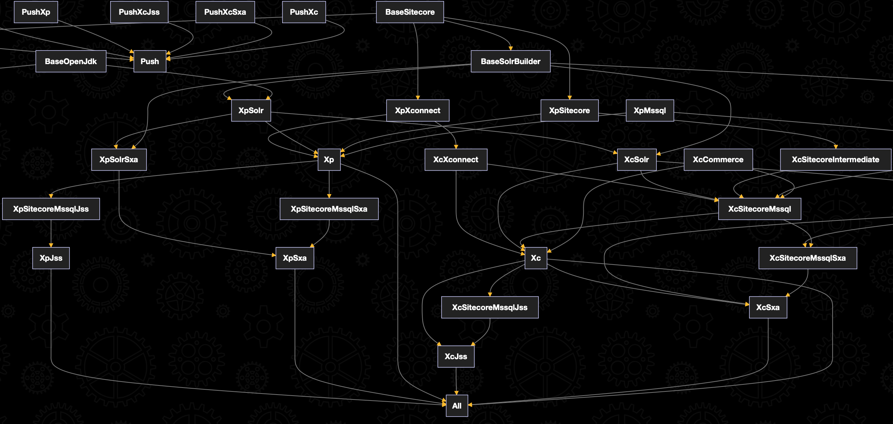

+++
title = "Building Docker images using Nuke.Build"
date = "2019-04-12"
tags = ["Docker"]
+++

Building a single Docker image is straightforward, building multiple Docker images is slightly more difficult, but building multiple Docker images that depend on eachother is a daunting task. The latter is where a good build system can really help you.
<!--more-->

The basic idea is to leverage a build system for building Docker images by creating a build target per Docker image and let the build system calculate (and execute) the dependency tree for you.

The build system I chose for this is [Nuke.Build](http://www.nuke.build). It's a relatively new kid on the block in the world of (.Net) build systems, where more commonly PSake, Cake, Fake, etc are used, but its ease-of-use is very promising. In short Nuke.Build is a cross-platform build automation system with a C# DSL. Nuke.Build basically creates a .Net Core console application that you run to perform your build. Having a C# build system seems to be a natural fit for Sitecore developers who typically write C# code. 

## Base and XP
Looking at the characteristics of a Sitecore Docker image build it consists of a number of images. As basis it has a number *base* images: 
- `openjdk`: Windows Server Core + OpenJDK 
- `sitecore`: Windows Server Core + ASP.NET + commonly used tools (e.g. SIF, choco, vim)
- `solr-build`: Solr installation (on top of `openjdk`)

For each Docker image we define a Nuke.Build target, e.g. for the `openjdk` image:
```
Target BaseOpenJdk => _ => _
    .Executes(() =>
    {
        DockerBuild(x => x
            .SetPath(".")  
            .SetFile("base/openjdk/Dockerfile")
            .SetTag(BaseImageName("openjdk"))
        );
    });
```

In above code snippet (full snippet [here](https://github.com/avivasolutionsnl/sitecore-docker/blob/601f158cdbc69622b4c11ae5125ab19cdfdf4326/build/Build.Base.cs#L25)) we define a target name *BaseOpenJdk* and it perform a Docker build command. The similar Docker CLI command would be:
```
PS> docker build -file "base/openjdk/Dockerfile" -tag "openjdk" .
```
Nuke.Build has the `DockerBuild` command [built-in](https://nuke.build/api/Nuke.Docker/Nuke.Docker.DockerTasks.html).

As you can see the `solr-build` image depends on the `openjdk` image. To specify this dependency we use the `DependsOn` clause for the `solr-build` target (full snippet [here](https://github.com/avivasolutionsnl/sitecore-docker/blob/601f158cdbc69622b4c11ae5125ab19cdfdf4326/build/Build.Base.cs#L47)):
```
Target BaseSolrBuilder => _ => _
    .DependsOn(BaseSitecore)
    .Executes(() =>
    {
        ...
        DockerBuild(x => x
            ...
            .SetBuildArg(new string[] {
                $"BASE_IMAGE={baseImage}"
            })
        );
    });
```
Nuke.Build will now build the `openjdk` target before the `solr-builder` target which is exactly what we need. As bonus we can now easily configure what the base image of the `solr-builder` is using a variable (`BASE_IMAGE`) in the Dockerfile. This gives us the flexibility to manage the versioniong (using Docker tags) in Nuke.Build instead of having the Docker tags hard-coded in (multiple) Dockerfiles.

Above approach, using `DependsOn`, can be applied similarly to build the Sitecore XP Docker images (see [here](https://github.com/avivasolutionsnl/sitecore-docker/blob/master/build/Build.Xp.cs)). Note that Nuke.Build targets are grouped in separate C# files, each holding a partial C# class that inheriting from `NukeBuild`.

# XC (and Sitecore packages)
Things get more complicated when a running Sitecore system is required to create a Docker image, as is the case for Sitecore XC Docker images. A running Sitecore system is basically required because a Sitecore Package, e.g. Sitecore Commerce Connect, cannot be installed offline. 
To tackle this challenge during a Nuke.Build we;
- start Sitecore using Docker Compose
- install the the Sitecore package
- stop using Docker Compose
- commit the modified containers (e.g. Sitecore, MSSQL) as Docker image

For adding Commerce Connect to the XC Sitecore and MSSQL Docker image the code (full snippet [here](
https://github.com/avivasolutionsnl/sitecore-docker/blob/601f158cdbc69622b4c11ae5125ab19cdfdf4326/build/Build.Xc.cs#L183)) looks as follows:
```
Target XcSitecoreMssql => _ => _
    ...
    .DependsOn(XcCommerce, XcMssqlIntermediate, XcSitecoreIntermediate, XcSolr, XcXconnect)
    .Executes(() => {
        System.IO.Directory.SetCurrentDirectory("xc");
        ...
        InstallSitecorePackage(
            @"C:\Scripts\InstallCommercePackages.ps1", 
            XcImageName("sitecore"), 
            XcImageName("mssql"),
            "-f docker-compose.yml"
        );
        ...
    });
``` 
In above code we define that it depends on XC *Commerce*, *Mssql*, *Sitecore*, *Solr* and *Xconnect* targets (which produce each a Docker image) before the `XcSitecoreMssql` target can be executed. Note that we name the target/Docker images that are not final (and only used during build) as *intermediate*.
Once the pre-conditions are met we perform `InstallSitecorePackage`, this performs the earlier mentioned steps:
```
private void InstallSitecorePackage(...)
{
    DockerCompose($"{dockerComposeOptions} {DockerComposeSilenceOptions} down");

    try
    {
        DockerCompose($"{dockerComposeOptions} {DockerComposeSilenceOptions} up -d");

        // Install Commerce Connect package
        var sitecoreContainerName = GetContainerName("sitecore");
        DockerExec(x => x
            .SetContainer(sitecoreContainerName)
            .SetCommand("powershell")
            .SetArgs(scriptFilename)
        );

        DockerCompose($"{DockerComposeSilenceOptions} stop");

        // Persist changes to DB installation directory
        DockerCompose($"{dockerComposeOptions} {DockerComposeSilenceOptions} up -d mssql");

        ...

        // Commit changes
        DockerCommit(x => x
            .SetContainer(mssqlContainerName)
            .SetRepository(mssqlTargetImageName));

        DockerCommit(x => x
            .SetContainer(sitecoreContainerName)
            .SetRepository(sitecoreTargetImageName));
    }
    ...
}
```
The full code for it can be found [here](https://github.com/avivasolutionsnl/sitecore-docker/blob/601f158cdbc69622b4c11ae5125ab19cdfdf4326/build/Build.cs#L78)

## Full build execution plan
All the Sitecore Docker images together (base, XP, XC, and variants) result in a quite complex build order which isn't managable without a system, like Nuke.Build, that calculates it for you. The current plan, without all *Push* targets (which are used to push the images to a Docker registry), looks as follows:



I hope this article, and the full setup (available [here](
https://github.com/avivasolutionsnl/sitecore-docker)), will help you to build your (Sitecore) Docker images and I look forward to receiving any feedback!
 